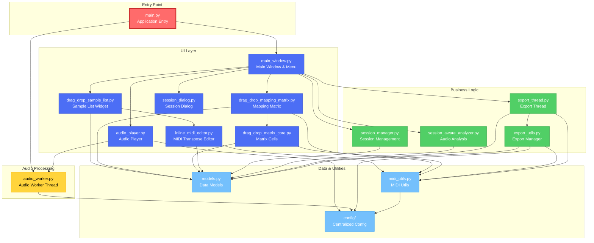
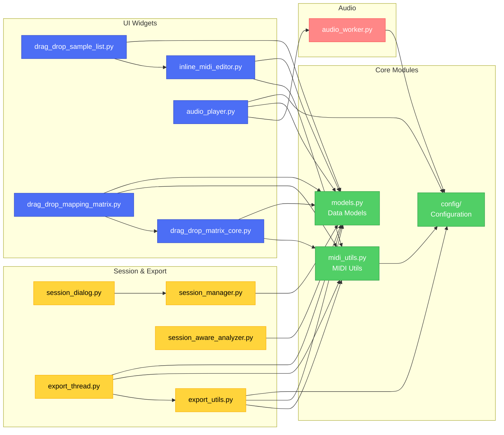
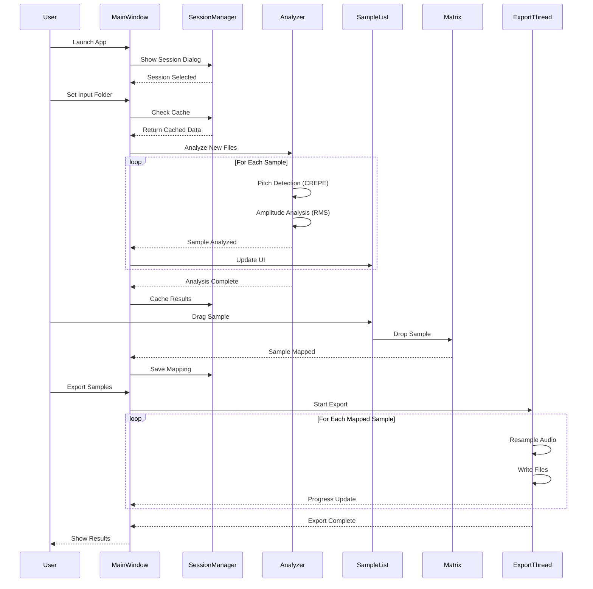

# Simple Sample Editor

Sample mapping tool with pitch detection, velocity analysis, and intelligent session management.

[](https://www.python.org/)
[](https://www.qt.io/)
[](...)

### Core Functionality
- CREPE Pitch Detection** - High-accuracy neural pitch detection (TensorFlow CREPE)
- RMS Velocity Analysis** - Intelligent amplitude analysis (500ms window)
- Drag & Drop Interface** - Visual sample mapping with dedicated drag buttons
- Session Management** - Project-based workflow with MD5-based caching
- Multi-format Export** - Simultaneous export to 44.1kHz and 48kHz

### Advanced Functionality
- Hash-based Caching
- Smart Auto-assign
- Configurable Velocity Layers
- GUI Menu Integration
- Centralized Configuration

---

## Architecture Overview

### High-Level System Architecture



### Module Dependencies



### Configuration Module Structure

```mermaid
graph TB
    subgraph "config/ Directory"
        INIT[__init__.py<br/>Exports: GUI, AUDIO, EXPORT, APP]

        GUI_CFG[gui_config.py<br/>GUI Constants]
        AUDIO_CFG[audio_config.py<br/>Audio Constants]
        EXPORT_CFG[export_config.py<br/>Export Constants]
        APP_CFG[app_config.py<br/>App Constants]

        INIT --> GUI_CFG
        INIT --> AUDIO_CFG
        INIT --> EXPORT_CFG
        INIT --> APP_CFG
    end

    subgraph "GUI Configuration"
        COLORS[Colors<br/>Theme colors]
        DIMS[Dimensions<br/>Widget sizes]
        SPACING[Spacing<br/>Layout spacing]
        FONTS[Fonts<br/>Font settings]
        TEXTS[Texts<br/>UI strings]
        STYLES[Styles<br/>QSS styles]

        GUI_CFG --> COLORS
        GUI_CFG --> DIMS
        GUI_CFG --> SPACING
        GUI_CFG --> FONTS
        GUI_CFG --> TEXTS
        GUI_CFG --> STYLES
    end

    subgraph "Audio Configuration"
        MIDI[MIDI<br/>MIDI constants]
        VELOCITY[Velocity<br/>Velocity layers]
        AUDIO[Audio<br/>Audio params]
        TIMING[Timing<br/>Timing params]
        TRANSPOSE[Transpose<br/>Transpose limits]
        SR_MAP[SampleRateMapping<br/>Sample rate suffixes]
        ANALYSIS[Analysis<br/>Analysis params]

        AUDIO_CFG --> MIDI
        AUDIO_CFG --> VELOCITY
        AUDIO_CFG --> AUDIO
        AUDIO_CFG --> TIMING
        AUDIO_CFG --> TRANSPOSE
        AUDIO_CFG --> SR_MAP
        AUDIO_CFG --> ANALYSIS
    end

    subgraph "Export Configuration"
        FORMATS[ExportFormats<br/>Sample rates]
        PROGRESS[ExportProgress<br/>Progress settings]
        VALIDATION[ExportValidation<br/>Validation rules]
        ERRORS[ExportErrors<br/>Error messages]
        NAMING[ExportFileNaming<br/>File naming]
        AUDIO_PARAMS[AudioExportParams<br/>Export quality]

        EXPORT_CFG --> FORMATS
        EXPORT_CFG --> PROGRESS
        EXPORT_CFG --> VALIDATION
        EXPORT_CFG --> ERRORS
        EXPORT_CFG --> NAMING
        EXPORT_CFG --> AUDIO_PARAMS
    end

    subgraph "App Configuration"
        APP_INFO[AppInfo<br/>Version, name]
        CACHE[CacheConfig<br/>Cache settings]
        SESSION_CFG[SessionConfig<br/>Session params]
        FILTERS[FileFilters<br/>File patterns]
        INTERVALS[UpdateIntervals<br/>UI update timing]
        LOGGING[LoggingConfig<br/>Log settings]

        APP_CFG --> APP_INFO
        APP_CFG --> CACHE
        APP_CFG --> SESSION_CFG
        APP_CFG --> FILTERS
        APP_CFG --> INTERVALS
        APP_CFG --> LOGGING
    end

    classDef config fill:#51cf66,stroke:#2f9e44,color:#fff,stroke-width:2px
    classDef category fill:#4c6ef5,stroke:#364fc7,color:#fff
    classDef detail fill:#74c0fc,stroke:#4dabf7,color:#fff

    class INIT config
    class GUI_CFG,AUDIO_CFG,EXPORT_CFG,APP_CFG category
    class COLORS,DIMS,SPACING,FONTS,TEXTS,STYLES,MIDI,VELOCITY,AUDIO,TIMING,TRANSPOSE,SR_MAP,ANALYSIS,FORMATS,PROGRESS,VALIDATION,ERRORS,NAMING,AUDIO_PARAMS,APP_INFO,CACHE,SESSION_CFG,FILTERS,INTERVALS,LOGGING detail
```



### Data Flow



---

## Installation

### Requirements
- **Python:** 3.9–3.12 recommended
- **OS:** Windows, macOS, or Linux with system audio configured
- **Dependencies:** See requirements.txt

### Setup

**Windows (PowerShell):**
```powershell
python -m venv .venv
.venv\Scripts\Activate
pip install --upgrade pip
pip install -r requirements.txt
```

**macOS/Linux (bash):**
```bash
python3 -m venv .venv
source .venv/bin/activate
python -m pip install --upgrade pip
pip install -r requirements.txt
```

### Dependencies

All dependencies are listed in `requirements.txt` and include:

```bash
# Install all dependencies
pip install -r requirements.txt

# Key dependencies:
# - PySide6: GUI framework
# - crepe + tensorflow: CREPE pitch detection (required)
# - librosa: Audio processing
# - soundfile, sounddevice: Audio I/O
# - mido, python-rtmidi: MIDI support
# - pytest, pytest-qt: Testing framework
```

**Note:** TensorFlow is required for CREPE pitch detection. If analysis fails with "No module named 'tensorflow'", ensure all dependencies are installed via `pip install -r requirements.txt`.

### Launch Application

```bash
python main.py
```

---

## 📁 Project Structure

### Root Directory Layout

```
sample-editor/
├── main.py                          # 🚀 Application entry point
├── main_window.py                   # 🖼️ Main window & menu bar
│
├── config/                          # ⚙️ Centralized configuration
│   ├── __init__.py                  #    Exports: GUI, AUDIO, EXPORT, APP
│   ├── gui_config.py                #    GUI constants (colors, dimensions, texts)
│   ├── audio_config.py              #    Audio constants (MIDI, velocity, timing)
│   ├── export_config.py             #    Export constants (formats, validation)
│   └── app_config.py                #    App constants (cache, session, logging)
│
├── models.py                        # 📦 Data models (compatibility shim)
├── midi_utils.py                    # 🎹 MIDI utility functions
│
├── drag_drop_sample_list.py        # 📋 Sample list widget with drag-drop
├── inline_midi_editor.py            # ✏️ Inline MIDI transpose editor
├── drag_drop_mapping_matrix.py     # 🎯 Mapping matrix widget
├── drag_drop_matrix_core.py        # 🔲 Matrix cell implementation
│
├── audio_player.py                  # 🔊 Audio player widget
├── audio_worker.py                  # 🎵 Audio worker thread (MIDI tones)
│
├── session_manager.py               # 💾 Session management & caching
├── session_dialog.py                # 🗂️ Session selection dialog
├── session_aware_analyzer.py       # 📊 Batch audio analyzer
│
├── export_thread.py                 # 📤 Async export thread
├── export_utils.py                  # 🔧 Export manager & validation
│
├── sessions/                        # 💾 Session files (JSON)
│   └── *.json                       #    Session data & cache
│
├── src/                             # 🏗️ Refactored architecture (DDD)
│   ├── domain/                      #    Domain models & interfaces
│   ├── application/                 #    Application services
│   ├── infrastructure/              #    Infrastructure implementations
│   └── presentation/                #    Presentation layer
│
├── tests/                           # 🧪 Unit & integration tests
│   ├── unit/                        #    Unit tests
│   └── integration/                 #    Integration tests
│
├── __old__/                         # 🗄️ Deprecated/old files
│
├── requirements.txt                 # 📦 Runtime dependencies
├── requirements-dev.txt             # 🛠️ Development dependencies
├── pytest.ini                       # ⚙️ Pytest configuration
└── README.md                        # 📖 This file
```

### Key Module Responsibilities

#### Entry Point
- **main.py** - Initializes Qt application, handles graceful shutdown

#### Core UI
- **main_window.py** - Main application window, orchestrates all functionality
- **drag_drop_sample_list.py** - Sample list with drag-drop and inline editing
- **drag_drop_mapping_matrix.py** - MIDI note mapping matrix
- **inline_midi_editor.py** - Per-sample transpose controls

#### Audio
- **audio_player.py** - Audio playback widget with sample and MIDI tone preview
- **audio_worker.py** - Dedicated worker thread for non-blocking audio playback

#### Session & Analysis
- **session_manager.py** - Session persistence with MD5-based caching
- **session_dialog.py** - Session creation/selection dialog
- **session_aware_analyzer.py** - Batch audio analyzer with cache integration

#### Export
- **export_thread.py** - Asynchronous export with progress reporting
- **export_utils.py** - Export manager with sample rate conversion

#### Configuration
- **config/** - Centralized type-safe configuration module:
  - `gui_config.py` - UI constants (colors, dimensions, texts, styles)
  - `audio_config.py` - Audio constants (MIDI, velocity, timing, analysis)
  - `export_config.py` - Export constants (formats, validation, error messages)
  - `app_config.py` - Application constants (cache, session, logging)

#### Utilities
- **midi_utils.py** - MIDI utilities (note conversion, filename generation)
- **models.py** - Data models (compatibility shim for src/ refactoring)

---

## Quick Start

### 1. Launch Application
```bash
python main.py
```

### 2. Create/Select Session
- **First launch:** Create new session with custom name
- **Configure:** Set velocity layers (1-8, default: 4)
- **Sessions folder:** `sessions/session-name.json`

### 3. Load Samples
- **Menu:** `File → Set Input Folder` (`Ctrl+I`)
- **Auto-analysis:** Pitch and RMS detection begins automatically
- **Cache:** Previously analyzed samples load instantly

### 4. Map Samples
- **Drag & Drop:** Click drag button (⋮⋮) and drop to matrix
- **Auto-assign:** Click ⚡ button for automatic velocity distribution
- **Manual edit:** Use transpose buttons (-12/-1/+1/+12) for pitch correction

### 5. Preview & Compare
- **Green ♪ button:** Play audio sample
- **Pink ♫ button:** Play reference MIDI tone (for pitch comparison)
- **Keyboard:** `Space` = play sample, `M` = play MIDI tone, `Esc` = stop

### 6. Export
- **Menu:** `File → Export Samples` (`Ctrl+E`)
- **Output:** Set folder (`Ctrl+O`)
- **Format:** `mXXX-velY-fZZ.wav` (MIDI-velocity-samplerate)

---

## Interface Guide

### Sample List (Left Panel - 40%)
| Element | Function |
|---------|----------|
| **⋮⋮ Drag button** | Drag sample to mapping matrix |
| **☐ Disable checkbox** | Temporarily exclude sample |
| **MIDI number** | Detected MIDI note (editable) |
| **Note name** | Musical note (e.g., C4, F#3) |
| **RMS value** | Amplitude (velocity) measurement |
| **-12/-1/+1/+12** | Transpose pitch detection |
| **♪ Green button** | Play audio sample |
| **♫ Pink button** | Play reference MIDI tone |

### Mapping Matrix (Right Panel - 60%)
| Element | Function |
|---------|----------|
| **♪ Play MIDI** | Generate reference tone for that MIDI note |
| **⌫ Reset** | Clear all samples for MIDI note |
| **⚡ Auto-assign** | Automatic velocity mapping (center-based algorithm) |
| **Matrix cells** | Drag samples here, left-click to play/remove |
| **Velocity layers** | V0-V7 (or custom 1-8 layers) |

### Audio Player Panel
- **Play/Stop controls** - Audio playback management
- **MIDI tone support** - Reference tone generation
- **Worker thread** - Non-blocking audio processing

---

## ⌨️ Keyboard Shortcuts

### File Operations
| Shortcut | Action |
|----------|--------|
| `Ctrl+N` | New Session |
| `Ctrl+I` | Set Input Folder |
| `Ctrl+O` | Set Output Folder |
| `Ctrl+E` | Export Samples |
| `Ctrl+Q` | Exit Application |

### Edit Operations
| Shortcut | Action |
|----------|--------|
| `Ctrl+K` | Clear Matrix |
| `F5` | Refresh Samples |
| `T` | Sort by MIDI and RMS |

### Playback Controls
| Shortcut | Action |
|----------|--------|
| `Space` | Play Current Sample |
| `M` | Play Reference MIDI Tone |
| `Esc` | Stop Playback |

---

## 💾 Session Management

### Automatic Caching
Sessions store and cache:
- **Pitch Detection Results** - MD5-based sample analysis
- **Amplitude Data** - RMS velocity measurements
- **MIDI Mappings** - Sample-to-position assignments
- **Transposition Changes** - Modified pitch values
- **Folder Paths** - Input/output preferences
- **Velocity Layer Config** - Session-specific settings

### Session File Structure
`sessions/session-name.json`:
```json
{
  "session_name": "DrumKit2024",
  "created": "2025-10-12T10:30:00",
  "velocity_layers": 4,
  "folders": {
    "input": "/path/to/samples",
    "output": "/path/to/export"
  },
  "samples_cache": {
    "abc123def456...": {
      "filename": "kick_01.wav",
      "detected_midi": 36,
      "detected_frequency": 65.41,
      "velocity_amplitude": 0.456789,
      "analyzed": true
    }
  },
  "mapping": {
    "36,0": "abc123def456...",
    "36,1": "def789ghi012..."
  }
}
```

---

### Sample Export = Naming Convention
```
mXXX-velY-fZZ.wav
```
- `XXX` = MIDI note (021-108, zero-padded)
- `Y` = Velocity level (0-7 or custom)
- `ZZ` = Sample rate (44 or 48)

### Examples
- `m036-vel0-f44.wav` → C2, softest velocity, 44.1kHz
- `m060-vel4-f48.wav` → C4 (Middle C), medium velocity, 48kHz
- `m108-vel7-f44.wav` → C8, loudest velocity, 44.1kHz

### Export Specifications
- **Format:** 16-bit PCM WAV
- **Sample Rates:** 44.1kHz and 48kHz (simultaneous)
- **Channels:** Mono or Stereo (preserves source)

---

## Configuration System

The application uses a centralized configuration module for type-safe access to all constants:

```python
from config import GUI, AUDIO, EXPORT, APP

# GUI configuration
button_width = GUI.Dimensions.BTN_DRAG_WIDTH
primary_color = GUI.Colors.PRIMARY
status_text = GUI.Texts.AUDIO_READY

# Audio configuration
piano_range = (AUDIO.MIDI.PIANO_MIN_MIDI, AUDIO.MIDI.PIANO_MAX_MIDI)
velocity_levels = AUDIO.Velocity.EXPORT_MAX + 1
sample_rate = AUDIO.Audio.DEFAULT_SAMPLE_RATE

# Export configuration
export_formats = EXPORT.Formats.FORMATS
resample_quality = EXPORT.AudioParams.RESAMPLE_QUALITY
error_message = EXPORT.Errors.NO_SAMPLES

# App configuration
app_version = APP.Info.VERSION
cache_ttl = APP.Cache.DEFAULT_TTL
session_folder = APP.Paths.SESSIONS_FOLDER
```

### Configuration Categories

#### GUI Configuration (gui_config.py)
- **Colors** - Theme and status colors
- **Dimensions** - Widget sizes and constraints
- **Spacing** - Layout spacing and margins
- **Fonts** - Font families and sizes
- **Texts** - UI strings and messages
- **Formatting** - Number and text formatting
- **Styles** - QSS stylesheets

#### Audio Configuration (audio_config.py)
- **MIDI** - MIDI constants (note ranges, frequencies)
- **Velocity** - Velocity layer configuration
- **Audio** - Audio parameters (sample rates, volumes)
- **Timing** - Timing parameters (delays, durations)
- **Transpose** - Transpose limits and increments
- **ChunkSizes** - Audio processing chunk sizes
- **SampleRateMapping** - Sample rate suffix mapping
- **Analysis** - Analysis parameters (window sizes, methods)

#### Export Configuration (export_config.py)
- **ExportFormats** - Export sample rate formats
- **ExportProgress** - Progress bar settings
- **ExportValidation** - Validation rules
- **ExportErrors** - Error message templates
- **ExportFileNaming** - File naming patterns
- **AudioExportParams** - Audio quality parameters
- **BatchProcessing** - Batch export settings
- **ExportStatistics** - Statistics tracking

#### App Configuration (app_config.py)
- **AppInfo** - Application metadata (version, name)
- **CacheConfig** - Cache settings (TTL, max size)
- **SessionConfig** - Session parameters
- **FileFilters** - File type filters
- **UpdateIntervals** - UI update intervals
- **BatchConfig** - Batch processing settings
- **LoggingConfig** - Logging configuration
- **Paths** - Default paths
- **ValidationRules** - Validation parameters
- **Defaults** - Default values

---

## Testing

### Run Tests

```bash
# All tests
pytest

# Unit tests only
pytest -m unit

# Integration tests
pytest -m integration

# Verbose with short tracebacks
pytest -v --tb=short

# Show test durations
pytest --durations=10
```

### Test Structure
```
tests/
├── unit/
│   ├── domain/
│   ├── application/
│   └── infrastructure/
└── integration/
```

---

---

## 🎼 Supported Audio Formats

**Input:**
- WAV (all bit depths)
- FLAC (lossless)
- AIFF (Apple)
- MP3 (via librosa)

**Output:**
- WAV (16-bit PCM standard)

---

## Future Enhancements

Potential features:
- [ ] Real-time pitch shifting on export
- [ ] Batch transpose operations
- [ ] Sample trimming/cropping
- [ ] Advanced filtering options
- [ ] Multi-session management
- [ ] MIDI file import for mapping templates
- [ ] VST/AU plugin format export
- [ ] Advanced waveform visualization

---

## License

Professional sample editor for music production workflows.

**Version:** 2.0
**Framework:** PySide6
**License:** MIT

---

## Contributing

This is a personal project. For bug reports or feature requests, please open an issue.
