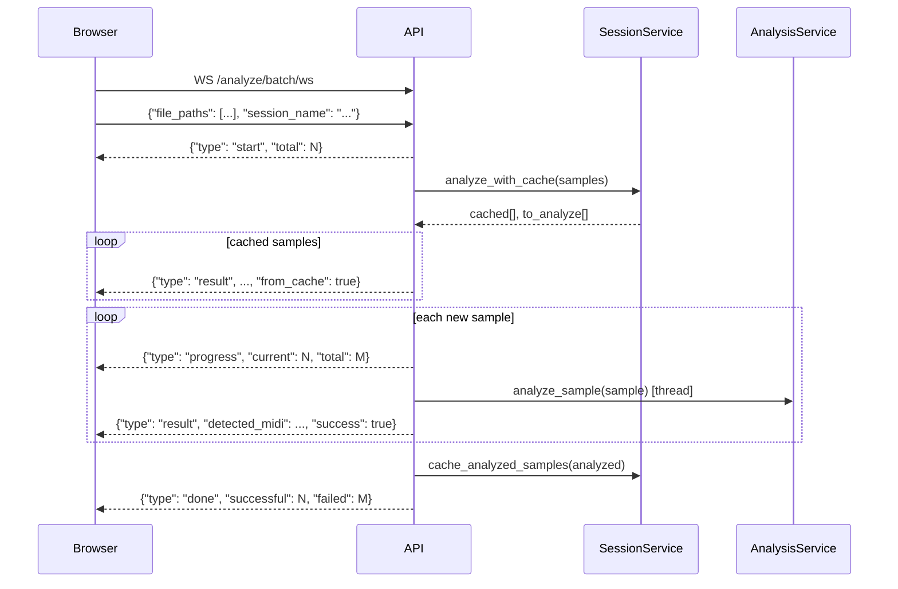

# Simple Sample Editor

Sample mapping tool with pitch detection, velocity analysis, and intelligent session management.

[](https://www.python.org/)
[](https://fastapi.tiangolo.com/)
[](...)

### Core Functionality
- **CREPE Pitch Detection** — High-accuracy neural pitch detection (TensorFlow CREPE)
- **RMS Velocity Analysis** — Intelligent amplitude analysis (500ms window)
- **Web Interface** — Browser-based SPA with retro Yamaha A3000 styling
- **Session Management** — Project-based workflow with MD5-based caching
- **Multi-format Export** — Simultaneous export to 44.1kHz and 48kHz WAV

### Advanced Functionality
- Hash-based file caching (re-analysis skipped for unchanged files)
- WebSocket batch analysis with real-time per-sample progress
- Configurable velocity layers (1–8)
- REST API with Swagger docs (`/docs`)
- Clean architecture: domain / application / infrastructure

---

## Architecture Overview

### System Architecture

```
┌─ WEB BROWSER ──────────────────────────────┐
│  frontend/index.html + style.css + app.js  │
│  Vanilla JS SPA — state, drag-drop, modals │
└──────────────────┬─────────────────────────┘
                   │ HTTP / WebSocket
                   ▼
          http://localhost:8000
┌─ FastAPI REST API ──────────────────────────┐
│  POST /api/v1/analyze                       │  → CREPE + RMS
│  POST /api/v1/analyze/batch                 │  → batch (blocking)
│  WS   /api/v1/analyze/batch/ws              │  → batch + progress
│  CRUD /api/v1/session/*                     │  → session mgmt
│  POST /api/v1/export                        │  → WAV export
│  GET  /api/v1/audio/file                    │  → audio stream
└──────────────────┬─────────────────────────┘
                   │ Python
┌─ Core Services ─────────────────────────────┐
│  AnalysisService   — orchestrates analysis  │
│  SessionService    — session + caching      │
│  ExportManager     — WAV resampling         │
└──────────────────┬─────────────────────────┘
                   │ librosa / CREPE / soundfile
┌─ Audio Files ───────────────────────────────┐
│  data/{session}/samples/   ← uploaded WAV   │
│  data/{session}/export/    ← exported WAV   │
│  sessions/session-*.json   ← session data   │
└─────────────────────────────────────────────┘
```

### Project Structure

```
sample-editor/
├── api/                             # FastAPI backend
│   ├── main.py                      #   App, CORS, static file mount
│   ├── run.py                       #   Uvicorn entry point
│   ├── schemas.py                   #   Pydantic request/response models
│   ├── dependencies.py              #   Singleton service injection
│   ├── data_dirs.py                 #   data/ directory helpers
│   └── routers/
│       ├── analyze.py               #   /analyze, /analyze/batch, /analyze/batch/ws
│       ├── session.py               #   /session CRUD
│       ├── export.py                #   /export
│       └── files.py                 #   /files upload/download
│
├── frontend/                        # Web SPA
│   ├── index.html                   #   Single-page app with modals
│   ├── style.css                    #   Retro styling (~1100 lines)
│   └── app.js                       #   State management + UI logic
│
├── src/                             # Clean architecture core
│   ├── domain/
│   │   ├── models/sample.py         #   SampleMetadata (central entity)
│   │   └── interfaces/              #   IPitchAnalyzer, IAmplitudeAnalyzer, ISessionRepository
│   ├── application/
│   │   └── services/
│   │       ├── analysis_service.py  #   Pitch + amplitude orchestration
│   │       └── session_service.py   #   Session mgmt, cache, persistence
│   └── infrastructure/
│       ├── audio/
│       │   ├── crepe_analyzer.py    #   CREPE pitch detection
│       │   ├── rms_analyzer.py      #   RMS velocity measurement
│       │   └── audio_file_loader.py #   librosa file loader
│       ├── persistence/
│       │   ├── session_repository_impl.py  # JSON session files
│       │   └── cache_manager.py     #   MD5-based file hash cache
│       └── export/                  #   WAV resampling + export
│
├── config/                          # Centralized constants
│   ├── audio_config.py              #   MIDI, velocity, timing
│   ├── export_config.py             #   Formats, naming, validation
│   └── app_config.py                #   Cache, session, logging
│
├── tests/                           # Unit + integration tests
├── requirements.txt                 # Runtime dependencies
├── requirements-dev.txt             # Dev dependencies
└── pytest.ini                       # Pytest configuration
```

### Data Flow — Batch Analysis (WebSocket)


```mermaid
sequenceDiagram
    participant Browser
    participant API
    participant SessionService
    participant AnalysisService

    Browser->>API: WS /analyze/batch/ws
    Browser->>API: {"file_paths": [...], "session_name": "..."}
    API-->>Browser: {"type": "start", "total": N}

    API->>SessionService: analyze_with_cache(samples)
    SessionService-->>API: cached[], to_analyze[]

    loop cached samples
        API-->>Browser: {"type": "result", ..., "from_cache": true}
    end

    loop each new sample
        API-->>Browser: {"type": "progress", "current": N, "total": M}
        API->>AnalysisService: analyze_sample(sample) [thread]
        API-->>Browser: {"type": "result", "detected_midi": ..., "success": true}
    end

    API->>SessionService: cache_analyzed_samples(analyzed)
    API-->>Browser: {"type": "done", "successful": N, "failed": M}
```

### REST API Endpoints

| Method | Path | Description |
|--------|------|-------------|
| `GET` | `/health` | Server health check |
| `POST` | `/api/v1/analyze` | Single file analysis (CREPE + RMS) |
| `POST` | `/api/v1/analyze/batch` | Batch analysis, blocking HTTP |
| `WS` | `/api/v1/analyze/batch/ws` | Batch analysis with real-time progress |
| `GET` | `/api/v1/audio/file` | Stream audio file (restricted to data/) |
| `GET` | `/api/v1/audio/info` | Audio file info (duration, SR, channels) |
| `GET` | `/api/v1/session/list` | List all sessions |
| `POST` | `/api/v1/session` | Create session |
| `GET` | `/api/v1/session/{name}` | Get session info |
| `POST` | `/api/v1/session/{name}/scan` | Scan folder for audio files |
| `POST` | `/api/v1/export` | Export mapped samples to WAV |
| `POST` | `/api/v1/files/upload` | Upload audio files to session |

Interactive API docs: `http://localhost:8000/docs`

---

## Installation

### Requirements
- **Python:** 3.9–3.12
- **OS:** Windows, macOS, or Linux
- **Browser:** Any modern browser (Chrome, Firefox, Edge)

### Setup

**Windows (PowerShell):**
```powershell
python -m venv .venv
.venv\Scripts\Activate
pip install --upgrade pip
pip install -r requirements.txt
```

**macOS/Linux (bash):**
```bash
python3 -m venv .venv
source .venv/bin/activate
pip install --upgrade pip
pip install -r requirements.txt
```

> **Note:** TensorFlow is required for CREPE pitch detection.
> First analysis request takes ~5–10 s while the model loads.

### Start the Server

```bash
python api/run.py
```

Then open `http://localhost:8000` in your browser.

---

## Quick Start

### 1. Start server
```bash
python api/run.py
# → http://127.0.0.1:8000
```

### 2. Create or open a session
- Click **New session** in the browser UI
- Set a name and number of velocity layers (1–8, default: 4)

### 3. Upload or scan samples
- **Upload:** Drag files into the upload zone
- **Scan folder:** Enter a local folder path to scan for WAV/FLAC/AIFF files

### 4. Analyze
- Click **Analyze** — CREPE detects pitch, RMS measures velocity
- Previously analyzed files are loaded from cache instantly
- Progress is shown in real time via WebSocket

### 5. Map samples
- Drag samples from the list to the MIDI matrix
- Use **Auto-assign** for automatic velocity distribution

### 6. Export
- Click **Export** — outputs `mXXX-velY-fZZ.wav` files to `data/{session}/export/`

---

## Export Format

### Naming Convention
```
mXXX-velY-fZZ.wav
```
- `XXX` = MIDI note (021–108, zero-padded)
- `Y` = Velocity layer (0–7 or custom 1–8)
- `ZZ` = Sample rate (44 = 44.1kHz, 48 = 48kHz)

### Examples
- `m036-vel0-f44.wav` → C2, softest, 44.1kHz
- `m060-vel4-f48.wav` → C4 (Middle C), medium, 48kHz
- `m108-vel7-f48.wav` → C8, loudest, 48kHz

### Export Specs
- **Format:** 16-bit PCM WAV
- **Sample rates:** 44.1kHz and 48kHz (both generated simultaneously)
- **Channels:** Mono or Stereo (preserves source)
- **Extra output:** `instrument-definition.json` with session metadata

---

## Session Management

Sessions are stored as JSON files in `sessions/session-{name}.json`.

```json
{
  "session_name": "DrumKit2024",
  "created": "2025-10-12T10:30:00",
  "velocity_layers": 4,
  "folders": {
    "input": null,
    "output": null
  },
  "samples_cache": {
    "abc123def456...": {
      "filename": "kick_01.wav",
      "detected_midi": 36,
      "detected_frequency": 65.41,
      "velocity_amplitude": 0.456789
    }
  },
  "mapping": {
    "36,0": "abc123def456...",
    "36,1": "def789ghi012..."
  }
}
```

Caching is MD5-based — if a file has not changed since last analysis, its result is returned immediately without re-running CREPE.

---

## Testing

```bash
# All tests
pytest tests/

# Specific test
pytest tests/unit/domain/
pytest tests/unit/infrastructure/

# Verbose
pytest tests/ -v --tb=short
```

### Test Structure
```
tests/
├── unit/
│   ├── domain/test_sample_metadata.py
│   ├── application/test_analysis_service.py
│   └── infrastructure/
│       ├── test_cache_manager.py
│       ├── test_crepe_analyzer.py
│       └── test_rms_analyzer.py
├── integration/
├── conftest.py
└── run_tests.py
```

---

## Supported Audio Formats

**Input:** WAV, FLAC, AIFF, AIF (via librosa)

**Output:** WAV 16-bit PCM (44.1kHz + 48kHz)

---

## Future Enhancements

- [ ] WebSocket progress for single-file analysis
- [ ] Real-time pitch shifting on export
- [ ] Sample trimming / cropping
- [ ] MIDI file import for mapping templates
- [ ] Multi-session management UI
- [ ] Authentication for multi-user deployments
- [ ] VST/AU plugin format export

---

## License

**Version:** 2.0
**Architecture:** FastAPI REST API + Vanilla JS SPA
**License:** MIT
